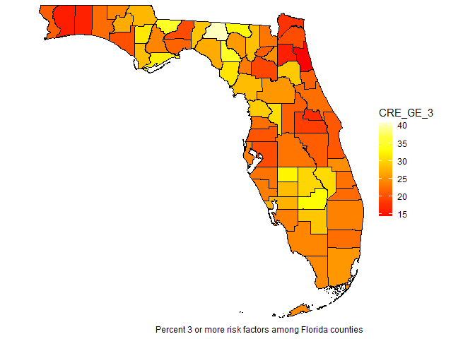

# RcensusPkg

Rick Dean 2025-01-21

The goal of RcensusPkg is to provide easy access to the US Census
Bureau’s
[datasets](https://www.census.gov/data/developers/data-sets.html) and
collection of TIGER/Line Shapefiles providing plot geometries for
states, counties, roads, landmarks, water, enumeration tracts/blocks for
the entire United States. The only requirement is for the user to apply
for and obtain a free access key issued from the Bureau. See [Guidance
for Developers](https://www.census.gov/data/developers/guidance.html)
for additional information.

The example below illustrates a simple workflow for downloading a
dataset, merging the data with shapefile geometries, and plotting the
merge to create a choropleth map.

## Installation

You can install the development version of RcensusPkg from
[GitHub](https://github.com/) with:

``` r
# install.packages("pak")
pak::pak("deandevl/RcensusPkg")
```

Using `devtools::install_github()`:

`devtools::install_github("deandevl/RcensusPkg")`

Also for the Example: `devtools::install_github("deandevl/RplotterPkg")`

## Example

### Setup

We will be using the following packages.

``` r
library(httr)
library(jsonlite)
library(stringr)
library(data.table)
library(withr)
library(sf)
library(kableExtra)
library(ggplot2)
library(RplotterPkg)
library(RcensusPkg)
```

### A look at the US Census Bureau’s community resilience estimates (CRE) database.

Among the list of [available
API](https://www.census.gov/data/developers/data-sets.html), there is
the Community Resilience Estimates based on such factors as:

-   Income-to-Poverty Ratio (IPR) \< 130 percent
-   Single or zero caregiver household
-   Aged 65 years or older
-   No health insurance coverage
-   No vehicle access (Household)
-   Disability, at least one serious constraint to significant life
    activity
-   No one in the household is employed full-time, year-round
-   Households without broadband internet access
-   Unit-level crowding with \>= 0.75 persons per room
-   No one in the household has received a high school diploma
-   No one in the household speaks English “very well”

The factors are used to estimate the number of people with:

-   0 risk factors (Low risk)
-   1-2 risk factors (Medium risk)
-   3 or more risk factors (High risk)

The workflow for using `RcensusPkg` is the following:

1.  Get a database name recognized by the API. Use
    `RcensusPkg::get_dataset_names()` filtering for a “resilience” title
    and vintage of 2022.

``` r
datasets_dt <- RcensusPkg::get_dataset_names(
  vintage = 2022,
  filter_title_str = "resilience"
)
```

| name          | vintage | title                                          |
|:--------------|--------:|:-----------------------------------------------|
| cre           |    2022 | Community Resilience Estimates                 |
| crepuertorico |    2022 | Community Resilience Estimates for Puerto Rico |

Table 1: ‘resilience’ datasets

The returned dataframe shows a dataset name for CRE 2022 as (surprise)
“cre”.

2.  Get the variable names available for the “cre” dataset.

``` r
cre_var_names_dt <- RcensusPkg::get_variable_names(
  dataset = "cre",
  vintage = 2022
) |> 
  _[, .(name, label)]
```

| name | label |
|:-----------------------------------|:-----------------------------------|
| COUNTY | Geography |
| GEOCOMP | GEO_ID Component |
| GEO_ID | Geographic Identifier |
| NATION | Geography |
| POPUNI | Population Universe |
| PRED0_E | Estimated number of individuals with zero components of social vulnerability |
| PRED0_PE | Rate of individuals with zero components of social vulnerability |
| PRED12_E | Estimated number of individuals with one-two components of social vulnerability |
| PRED12_PE | Rate of individuals with one-two components of social vulnerability |
| PRED3_E | Estimated number of individuals with three or more components of social vulnerability |
| PRED3_PE | Rate of individuals with three or more components of social vulnerability |
| STATE | Geography |
| SUMLEVEL | Summary Level code |
| TRACT | Geography |
| for | Census API FIPS ‘for’ clause |
| in | Census API FIPS ‘in’ clause |
| ucgid | Uniform Census Geography Identifier clause |

Table 2: Variable names from the CRE dataset

We are interested in the percentage of individuals with three or more
vulnerabilities (“PRED3_PE”)

3.  Get the regions available for the CRE dataset.

``` r
cre_regions_dt <- RcensusPkg::get_geography(
  dataset = "cre",
  vintage = 2022
)
```

| name   | geoLevelDisplay |
|:-------|:----------------|
| us     | 010             |
| state  | 040             |
| county | 050             |
| tract  | 140             |

Table 3: Regions from the CRE dataset

So we can get CRE estimates from the entire US, state, county, and tract
enumeration levels. We are interested in the counties for the state of
Florida.

4.  Download the data:

``` r
florida_fips <-  usmap::fips(("FL"))

florida_cre_dt <- RcensusPkg::get_vintage_data(
  dataset = "cre",
  vintage = 2022,
  vars = "PRED3_PE",
  region = "county",
  regionin = paste0("state:", florida_fips)
) |> 
  _[, PRED3_PE := as.numeric(PRED3_PE)] |> 
  data.table::setnames(old = "PRED3_PE", new = "CRE_GE_3")
```

| NAME                      | CRE_GE_3 | state | county | GEOID |
|:--------------------------|---------:|:------|:-------|:------|
| Alachua County, Florida   |    19.29 | 12    | 001    | 12001 |
| Baker County, Florida     |    22.93 | 12    | 003    | 12003 |
| Bay County, Florida       |    20.05 | 12    | 005    | 12005 |
| Bradford County, Florida  |    24.77 | 12    | 007    | 12007 |
| Brevard County, Florida   |    20.67 | 12    | 009    | 12009 |
| Broward County, Florida   |    22.44 | 12    | 011    | 12011 |
| Calhoun County, Florida   |    31.52 | 12    | 013    | 12013 |
| Charlotte County, Florida |    27.53 | 12    | 015    | 12015 |

Table 4: Florida county percent risk from the CRE dataset

5.  Merge the CRE county data with the Florida county shapefile
    geographies from the Bureau.

``` r
output_dir <- withr::local_tempdir()
if(!dir.exists(output_dir)){
  dir.create(output_dir)
}
express <- parse(text = paste0("STATEFP == ", '"', florida_fips, '"'))
cre_florida_sf <- RcensusPkg::tiger_counties_sf(
  output_dir = output_dir,
  vintage = 2022,
  general = TRUE,
  express = express,
  datafile = florida_cre_dt,
  datafile_key = "county"
)
```

6.  Plot the choropleth map of the percent of individuals with 3 or more
    risk factors.

``` r
RplotterPkg::create_sf_plot(
  sf = cre_florida_sf,
  aes_fill = "CRE_GE_3",
  hide_x_tics = TRUE,
  hide_y_tics = TRUE,
  panel_color = "white",
  panel_border_color = "white",
  caption = "Percent 3 or more risk factors among Florida counties"
)
```



A more detailed example of the `RcensusPkg` workflow is available
[here](https://rcensuspkg-ex.netlify.app/).
